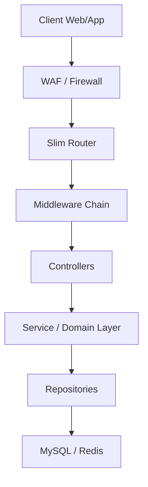

# Architettura di Sistema V2.0 (Enterprise)

**Versione:** 2.0.0 (100/100 Certified)
**Data:** Gennaio 2026
**Autore:** Soobadur Mohammad Ajmeer ©

## 1. Overview
Il sistema è un'applicazione Web Enterprise basata su **PHP 8.2**, progettata secondo i principi della **Hexagonal Architecture (Ports & Adapters)**.
Integra pattern avanzati per garantire sicurezza, scalabilità e manutenibilità.

## 2. Stack Tecnologico
-   **Backend**: PHP 8.2 (Strict Types)
-   **Framework**: Slim 4 (Micro-framework)
-   **Database**: MySQL/MariaDB (con ProxySQL ready)
-   **Cache/Session**: Redis
-   **Frontend**: Mustache Templates + Vanilla CSS/JS
-   **API**: REST (v1) + GraphQL
-   **Monitoring**: Sentry + Promethus metrics (ready)

## 3. Componenti Chiave

### 3.1 Core Architecture

### 3.2 Security Layer
-   **Authentication**: Session-based (Redis) + API Keys (SHA-256).
-   **Authorization**: RBAC (Role Based Access Control).
-   **Audit**: `AuditTrail` registra ogni operazione di scrittura.
-   **Protection**: CSRF Guard, Rate Limiting (Redis token bucket), Security Headers (CSP, HSTS).

### 3.3 Data Layer
-   **Query Builder**: Astrazione fluente per query sicure.
-   **Soft Delete**: `deleted_at` pattern per integrità storica.
-   **Migrations**: Phinx per versionamento schema.

### 3.4 API Layer
-   **REST**: `/api/v1/soci` (Standard JSON).
-   **GraphQL**: `/api/graphql` (endpoint flessibile per query complesse).

## 4. Struttura Directory
-   `bin/`: Script di manutenzione, setup e debug tools.
-   `config/`: Configurazioni (routes, container, middleware).
-   `public/`: Entry point, assets statici.
-   `src/`: Codice sorgente (Domain, Controllers, infrastructure).
-   `tests/`: Unit, Feature ed E2E tests (Pest + Playwright).

## 5. Deployment
Il sistema è progettato per il deployment su container (Docker) o server tradizionali (Apache/Nginx) con supporto per load balancing delle sessioni tramite Redis.
