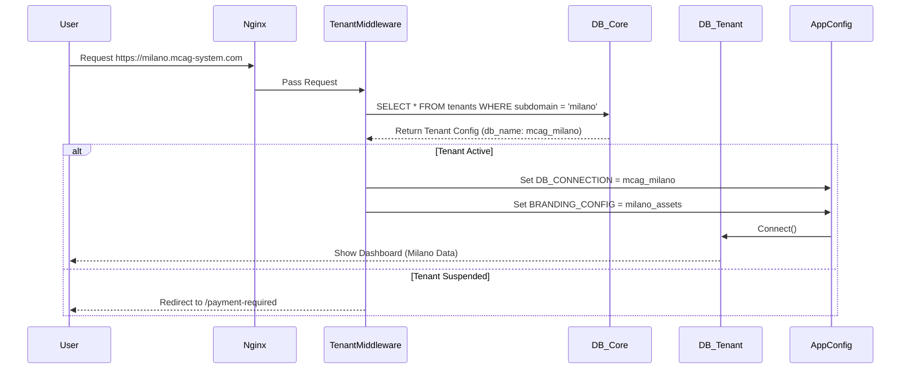

# ☁️ MCAG v9.0 - SaaS Multi-Tenancy Architecture Spec
**Author:** Soobadur Mohammad Ajmeer (Lead Architect)
**Type:** Database Isolation Strategy (Schema-per-Tenant)
**Objective:** Transform single-tenant on-premise app into a scalable SaaS platform.

---

## 1. Core Architecture Strategy
To guarantee GDPR compliance and maximum data security (Zero Leakage Risk), we will adopt the **Database-per-Tenant (Schema Separation)** strategy.

### Design Principles
1.  **Isolation**: Each Tenant (Client) has its own MySQL Database Schema (`mcag_tenant_101`, `mcag_tenant_102`).
2.  **Shared Kernel**: A central `mcag_core` database manages:
    *   `tenants` (Registry of clients)
    *   `subscriptions` (Billing status)
    *   `users_global` (Super Admins)
3.  **Dynamic Connection**: The application connects to `mcag_core` first, identifies the tenant via Subdomain, and switches the DB connection to the Tenant's Schema on the fly.

## 2. Request Lifecycle (The "TenantResolver")



## 3. Database Schema Changes

### `mcag_core` (New Central Database)
*   **`tenants`**
    *   `id` (UUID)
    *   `name` (string)
    *   `subdomain` (string, unique, index)
    *   `db_name` (string)
    *   `status` (active, suspended, archived)
    *   `plan_id` (fk)
    *   `created_at` (timestamp)

*   **`subscriptions`**
    *   `id` (UUID)
    *   `tenant_id` (fk)
    *   `stripe_subscription_id` (string)
    *   `current_period_end` (timestamp)

### `mcag_tenant_XXX` (Existing Schema)
*   *Legacy tables remain unchanged* (`soci`, `transazioni`, `pagamenti`).
*   **Migration Strategy**: To enable SaaS, we simply rename the current `mcag` database to `mcag_tenant_001` and create a fresh `mcag_core`.

## 4. Code Implementation Roadmap

### 4.1 Middleware (`src/Middleware/TenantMiddleware.php`)
Must intercept the HTTP Host header.
```php
$host = $_SERVER['HTTP_HOST']; // milano.mcag-system.com
$subdomain = explode('.', $host)[0];
$tenant = $tenantRepo->findBySubdomain($subdomain);
if (!$tenant) { throw new TenantNotFoundException(); }
```

### 4.2 Database Factory (`src/Core/DatabaseFactory.php`)
Modified to accept dynamic connection parameters at runtime, replacing the static `config.php` credentials.

### 4.3 Super-Admin Dashboard
A new route group `/super-admin` protected by a special `SystemAdmin` role.
*   List all Tenants.
*   "Login As" feature (Impersonation).
*   Create new Tenant (Triggers a SQL script to clone the `template_schema`).

## 5. Security Implications
*   **SQL Injection**: Impossible across tenants due to physical database separation.
*   **GDPR**: Data deletion is as simple as `DROP DATABASE mcag_tenant_XXX`.
*   **Backups**: Granular backups per tenant (easier to restore single client).

## 6. Migration Script (`bin/migrate_to_saas.php`)
A CLI script to:
1.  Read current `.env`.
2.  Create `mcag_core`.
3.  Move current tables to `mcag_tenant_default`.
4.  Insert record in `tenants` for the default/current installation.
