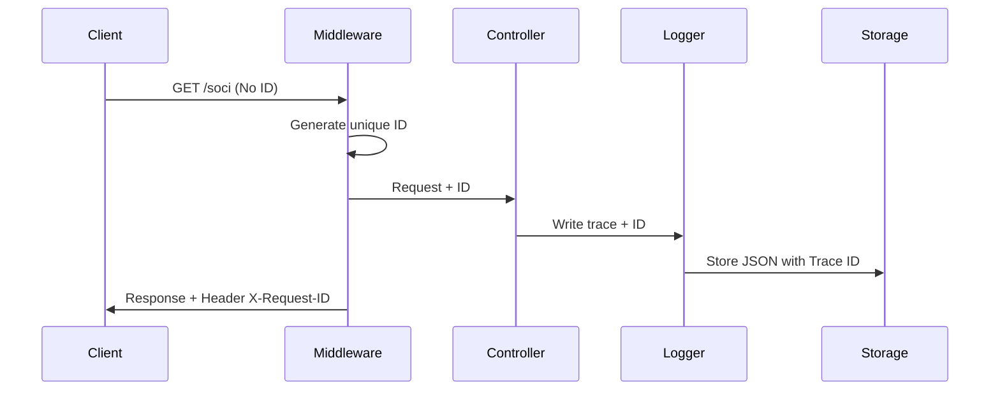

# System Design Document
**Project Name:** Digitalizzazione e Dematerializzazione Archivio Soci

| Document ID | SYSTEM DESIGN-v1.4 (Mission-Critical) |
| :--- | :--- |
| **Version Number** | 1.4 |
| **Issue Date** | December 21, 2025 |
| **Classification** | Private (Internal Use Only) |

**Copyright Notice**
© Fratellanza Militare di Firenze, 2025

All Rights Reserved. The information contained in this document is the property of Fratellanza Militare di Firenze.

---

## Revision History
| Date | Version | Description | Author (s) |
| :--- | :--- | :--- | :--- |
| ... | ... | ... | ... |
| 21/12/2025 | 1.3 | Database Auth, Dotenv, Pest Coverage | S. M. Ajmeer |
| 21/12/2025 | 1.4 | **Mission-Critical**: Transactions, Request IDs, Resilience Monitor | S. M. Ajmeer |

---

## 1. Introduction

### 1.1 Methodology & Standards (v1.4)
The system has been elevated to **Mission-Critical** standards, ensuring:
*   **ACID Compliance**: Via PDO Transactions for atomic member/document saving.
*   **Total Observability**: Via **Request Correlation ID** propagation.
*   **Disaster Resilience**: Via **BackupService** and rotative physical integrity checks.

---

## 2. Design Overview

### 2.3 Required Environment (v1.4)
*   **Architecture**: Layered MVC with **Dependency Injection**.
*   **Security**: 2FA, Rate Limiting, **Session Hardening (Strict)**, **Storage Lockdown**.
*   **Monitoring**: **ResilienceMonitor** & **LogAnalyzer** (Correlation IDs).

---

## 3. Logical Architecture

### 3.2 Application Architecture (Resilience Core)
1.  **Observability Layer**: `RequestIdMiddleware` (X-Request-ID).
2.  **Persistence Layer**: `SQLiteSocioRepository` with **Transaction Management**.
3.  **Diagnosis Layer**: `ResilienceMonitor` (Integrity Scan).

---

## 4. Physical Architecture (Security)
The storage directory is protected from direct script execution:
```text
storage/uploads/
├── .htaccess (Locks access & PHP execution)
└── [Member Documents]
```

---

## 5. Data Model

### 5.1 System Integrity Controls (v1.4)
*   **Atomic Saves**: `BEGIN TRANSACTION -> SAVE SOCIO -> SAVE DOCS -> COMMIT`.
*   **Foreign Keys**: Explicitly enabled via `PRAGMA foreign_keys = ON`.
*   **Backup Policy**: 14-day rolling window managed by `BackupService.php`.

---

## 6. Detailed Design (Observability)

### 6.1 Request Correlation
Every log entry (App/Audit) is decorated with a `request_id`.


### 6.2 Resource Lockdown
The `storage/uploads/` directory includes an `.htaccess` that prevents file listing and PHP script execution, mitigating RCE risks.

---

## 9. System Integrity Controls (v1.4)

*   **Atomic Persistence**: Ensures no "partial" saves occur during system failure.
*   **Resilience Monitor**: Periodic check of DB integrity, backup freshness, and session security.
*   **Incident Response**: `LogAnalyzer` allows extracting full traces for a specific `request_id`.
*   **Mission-Critical Console**: Interactive CLI for rapid disaster recovery and health checks.

---

**Appendix**
*   **Traceability Matrix**: See `../Analisi/CASI_D_USO.md`.
*   **API Reference**: See `../Manuali/API_REFERENCE.md`.
