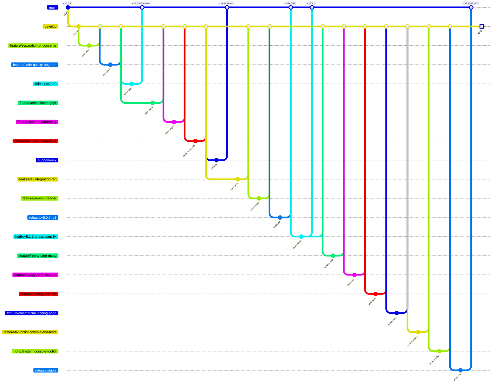

## Analisi Struttura Branch (95 Totali)

Il grafico sopra rappresenta il **flusso logico principale** estratto dai 95 branch presenti nel repository.

### 🌳 Organizzazione Gerarchica
*   **`main`**: Production-ready code (Tag: `v2.0.0`, `v4.0`, `v5.0`, `v5.3.0`).
*   **`stable`**: Pre-production staging area (usato per stabilizzazione `v5.3`).
*   **`develop`**: Development trunk, riceve tutti i merge delle feature.
*   **`support/v4.x`**: Branch di manutenzione Long Term Support per la versione legacy.

### 🚀 Categorie Branch Attivi
1.  **AI & Innovation**: `feature/ai-integration-rag`, `feature/ai-omni-reader`, `feature/v5.1-advanced-ai`.
2.  **Core Rebranding**: `feature/rebranding-mcag`, `feature/rebranding-mcag-v5.3`, `feature/legacy-path-cleanup`.
3.  **Commercial & Assets**: `feature/commercial-landing-page`, `feature/landing-ui-update`, `feature/legal-kit-finalization`.
4.  **DevOps & Tools**: `feature/devtools-ultimate-v4`, `feature/devops-pipeline`, `hotfix/system-console-toolkit`.
5.  **Security**: `feature/sec-api-hardening`, `feature/compliance-gdpr`, `feature/db-encryption`.
